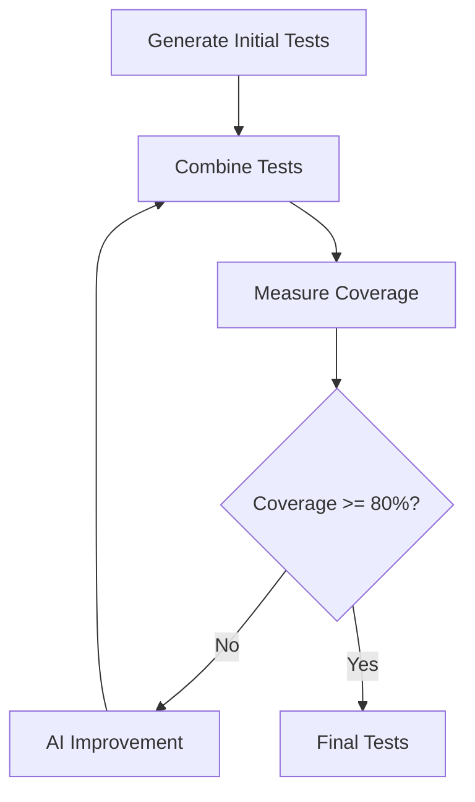

# Test Generation System: Architecture and Design Document

## Overview

This system automates the generation of pytest test cases using multiple approaches, combining them intelligently to achieve high test coverage. Rather than relying on a single test generation strategy, we leverage multiple methods and use AI to combine their strengths.

## Core Goals

1. **Maximum Coverage**: Generate tests that achieve at least 80% code coverage
2. **Property-Based Testing**: Leverage Hypothesis for robust property-based tests
3. **Multiple Strategies**: Use different approaches to catch edge cases
4. **AI Enhancement**: Use AI to intelligently combine and improve tests
5. **Minimal Setup**: Make it easy to generate tests for any Python code

## Key Design Principles

1. **Generation Independence**: Each test generator runs independently
2. **Coverage Over Passing**: Focus on covering code paths first
3. **Smart Combination**: Use AI to combine strengths of different approaches
4. **Property Focus**: Emphasize property-based testing via Hypothesis
5. **Iterative Improvement**: Continuously improve tests until coverage target is met

## System Components

### 1. Test Generators

We use three primary test generation approaches:

#### a) Hypothesis Ghost Writer
- Generates property-based tests
- Focuses on invariants and properties
- Very good at finding edge cases
- Example:
```python
@given(st.integers(), st.integers())
def test_addition_commutative(a, b):
    assert add(a, b) == add(b, a)
```

#### b) Fabric/GPT-4
- Uses AI to generate creative test cases
- Good at understanding code intent
- Handles complex scenarios well
- Example:
```python
def test_edge_cases():
    assert process_data([]) == []  # Empty input
    assert process_data([None]) is None  # None handling
    assert process_data([1, 2, 3]) == [2, 4, 6]  # Normal case
```

#### c) Pynguin
- Evolutionary algorithm-based test generation
- Good at finding specific code paths
- Limited to synchronous public methods
- Example:
```python
def test_generated_case_1():
    obj = MyClass()
    result = obj.process(42)
    assert isinstance(result, int)
```

### 2. Test Combination Engine

The combination engine uses AI (default: GPT-4) to:
1. Analyze tests from all generators
2. Remove redundancy while maintaining coverage
3. Improve test quality and readability
4. Add missing edge cases
5. Ensure consistent naming and style

### 3. Test Optimization Loop



## Usage Example

```python
from test_generator import generate_tests
from pathlib import Path

# Generate tests for a Python file
tests = await generate_tests(Path("my_code.py"))

# Tests are written to test_my_code.py
# Coverage report is generated
```

## Implementation Details

### TestCase Data Model
```python
@dataclass
class TestCase:
    """Represents a generated test case"""
    code: str  # The actual test code
    coverage: float = 0.0  # Coverage percentage
    source_generator: str = ""  # Which generator created it
```

### Configuration
```python
@dataclass
class TestConfig:
    """Configuration for test generation"""
    generators: List[TestGenerator]
    target_coverage: float = 0.8
    model_name: str = "gpt-4"
```

### Test Generation Process

1. **Initial Generation**
   - Run all test generators in parallel
   - Each generator produces independent test cases
   - Tests are collected and analyzed

2. **Combination**
   - AI examines all generated tests
   - Creates unified test suite
   - Maintains best properties of each approach

3. **Optimization**
   - Coverage is measured
   - If below target, AI improves tests
   - Process repeats until target coverage reached

## Best Practices

1. **Keep Original Tests**
   - Save original generated tests for reference
   - Useful for debugging and improvement

2. **Review Generated Tests**
   - AI-generated tests should be reviewed
   - May need manual tweaking for edge cases

3. **Regular Updates**
   - Re-run generation when code changes significantly
   - Update tests as new features are added

## Limitations and Considerations

1. **Coverage vs Correctness**
   - High coverage doesn't guarantee correct tests
   - Manual review recommended

2. **Resource Usage**
   - Multiple test generators require computational resources
   - AI combination can be time-consuming

3. **Edge Cases**
   - Some edge cases may still be missed
   - Complex logic may need manual test additions

## Future Improvements

1. Add support for more test generators
2. Improve AI combination strategies
3. Add test mutation capabilities
4. Support for more testing frameworks
5. Better handling of async code

## Conclusion

This system provides a comprehensive approach to automated test generation, combining multiple strategies to achieve high coverage while maintaining test quality. The use of AI for test combination and improvement helps create more maintainable and effective tests than any single generation strategy could achieve alone.