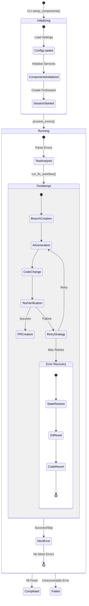

Let me analyze the design and its interaction with our fix workflow components:




Key Issues with the Current Design:

1. **State Management Integration**
- Missing connection between `FixService` and `StateManager`
- No clear point where `StateSnapshot` gets created during fix attempts
- `FixSession` needs to be integrated into `CLI.process_errors()`

2. **Recovery Flow Gaps**
```python
# Current cli.py
async def run_fix_workflow(self, error: TestError, interactive: bool) -> bool:
    try:
        # Creates branch and attempts fix
        # But doesn't handle state recovery if something fails
    except Exception as e:
        logger.error(f"Fix workflow failed: {e}")
        return False  # No recovery attempt
```

Should be:
```python
async def run_fix_workflow(self, error: TestError, interactive: bool) -> bool:
    try:
        await self.state_manager.save_checkpoint()
        # Existing workflow...
    except Exception as e:
        logger.error(f"Fix workflow failed: {e}")
        if await self.recovery_manager.handle_failure(
            self.active_session, type(e).__name__, {"error": error}
        ):
            return await self.retry_workflow(error, interactive)
        return False
```

3. **Missing Service Dependencies**
The `FixService` needs additional components:
```python
class FixService:
    def __init__(self,
                 ai_manager: AIManager,
                 test_runner: TestRunner,
                 change_applier: ChangeApplier,
                 git_repo: GitRepository,
                 state_manager: StateManager,      # Missing
                 recovery_manager: RecoveryManager, # Missing
                 interaction_manager: InteractionManager, # Missing
                 retry_strategy: RetryStrategy):    # Missing
```

4. **Lifecycle Management**
- No clear session lifecycle management
- State transitions not properly enforced
- Progress reporting disconnected from state changes

5. **Interaction Mode Handling**
Current CLI has basic interactive vs non-interactive mode, but needs:
```python
class FixService:
    async def attempt_fix(self, error: TestError) -> bool:
        if await self.interaction_manager.should_prompt("pre_fix"):
            if not await self.prompt_user(error):
                return False
                
        # Existing fix logic...
        
        if failed and await self.interaction_manager.should_prompt("failure"):
            action = await self.interaction_manager.handle_failure(
                self.active_session, error, attempt
            )
            return await self.handle_failure_action(action, error)
```

Recommendations:

1. Add Session Lifecycle Management:
```python
class SessionManager:
    def __init__(self, state_manager: StateManager, 
                 recovery_manager: RecoveryManager):
        self.state_manager = state_manager
        self.recovery_manager = recovery_manager
        
    async def run_session(self, errors: List[TestError]) -> bool:
        session = await self.state_manager.start_session(errors)
        try:
            return await self._process_errors(session)
        except Exception as e:
            return await self.recovery_manager.restore_session(session.id)
```

2. Integrate Progress Reporting:
```python
class ProgressManager:
    def __init__(self, session: FixSession):
        self.session = session
        self.reporter = ProgressReporter(session)
        
    async def update_on_state_change(self, old_state: SessionState, 
                                   new_state: SessionState) -> None:
        self.reporter.update_progress()
        if new_state == SessionState.COMPLETED:
            self.reporter.show_summary()
```

3. Enhance Error Recovery:
- Add checkpoints before risky operations
- Implement rollback capabilities
- Track modified files for recovery

4. Improve Interaction Flow:
- Clear separation of UI concerns
- Consistent prompting strategy
- Better error reporting

Would you like me to elaborate on any of these points or show more detailed implementation examples?