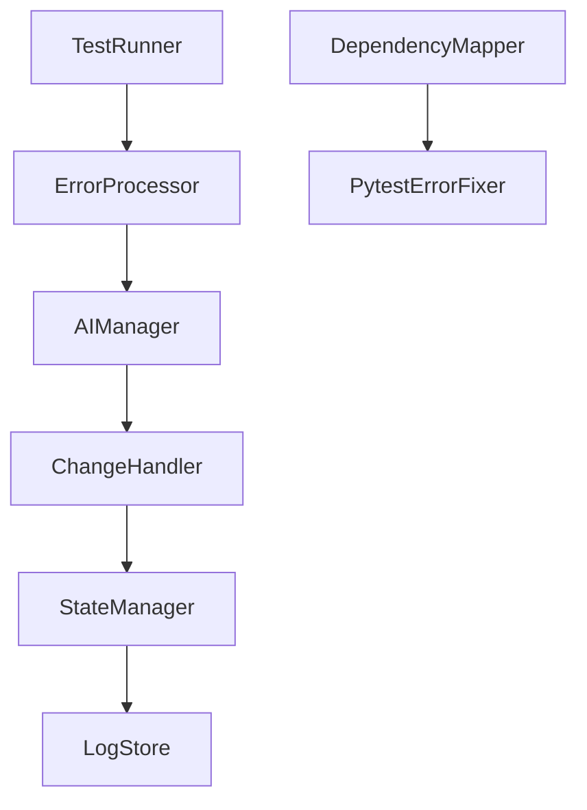

Here's a cleaned-up version of your document in **pretty Markdown** that maintains all the key features while improving readability and formatting:

---

# **pytest-fixer Documentation**

## **Overview**

**pytest-fixer** is an AI-powered tool designed to automatically identify and fix failing `pytest` tests in Python projects. By combining OpenAI's GPT models with intelligent error analysis and Git-based change management, it provides a robust solution for testing automation.

---

## **Core Architecture**

### **Component Structure**

1. **PytestErrorFixer**  
   - Orchestrates all components.  
   - Manages execution flow, state, initialization, and cleanup.

2. **TestRunner**  
   - Discovers test files matching `test_*.py`.  
   - Executes individual tests or full test suites.  
   - Captures `stdout`, `stderr`, and results as standardized objects.

3. **ErrorProcessor**  
   - Parses `pytest` output into structured data.  
   - Handles test failures, collection errors, and runtime issues.  
   - Extracts error context and details for fixing.

4. **DependencyMapper**  
   - Analyzes imports and code references.  
   - Maps relationships between test and source files.  
   - Supports both relative and absolute imports.

5. **AIManager**  
   - Manages OpenAI API interactions.  
   - Implements a temperature-based retry strategy.  
   - Constructs prompts and parses AI responses into actionable changes.

6. **StateManager**  
   - Tracks execution progress and state.  
   - Handles checkpoints, recovery, and logs.

7. **ChangeHandler**  
   - Applies, verifies, and reverts code changes.  
   - Manages logs and ensures smooth operations.

---

### **Component Interaction**



---

## **Key Features**

### **Test Processing**

- Automatic test discovery (excludes `.venv`).  
- Execution of individual test functions or files.  
- Dependency analysis and detailed error extraction.

### **AI Integration**

- **OpenAI GPT model integration** with retry mechanism:  
   ```python
   initial_temperature = 0.4
   temperature_increment = 0.1
   max_retries = 3
   ```
- **Context-aware prompt construction**, including:
  - Error details and stack traces.  
  - Previous attempt history.  
  - Code context and dependencies.  
  - Test output and logs.

### **Interactive Modes**

Operational modes for flexibility:
- `DISABLED`: Fully automated.  
- `ON_FAILURE`: Interactive on failures.  
- `ALWAYS`: Always interactive.  
- `MANUAL`: Triggered manually.

Interactive commands:
- `show`: Display errors and changes.  
- `edit`: Open changes in the default editor.  
- `apply`: Apply and test changes.  
- `retry`: Retry with higher temperature.  
- `prompt`: Modify AI prompt.  
- `diff`: Show Git differences.  
- `history`: View change history.  
- `quit`: Exit without changes.

### **State Management**

- Tracks session progress and checkpoints.  
- Logs state changes and error progression.

### **Git Integration**

- Creates isolated fix branches.  
- Handles branch lifecycle and change management.  
- Enables Git-based reversion and recovery.

---

## **Setup**

### **Requirements**

```plaintext
Python 3.8+
Git
OpenAI API Key
pytest
```

### **Installation**

```bash
git clone https://github.com/your-repo/pytest-fixer.git
cd pytest-fixer
pip install -r requirements.txt
```

### **Configuration**

Create a `.env` file:

```env
OPENAI_API_KEY=your-api-key
MODEL_NAME=gpt-4o-mini
INITIAL_TEMPERATURE=0.4
TEMPERATURE_INCREMENT=0.1
MAX_RETRIES=3
```

### **Usage**

```bash
python -m pytest_fixer.main /path/to/project [options]

Options:
  --initial-temperature FLOAT   Initial AI temperature (default: 0.4)
  --temperature-increment FLOAT Temperature increment (default: 0.1)
  --max-retries INT             Maximum fix attempts (default: 3)
  --model STRING                AI model (default: gpt-4o-mini)
  --debug                       Enable debug logging
  --manual-fix                  Enable manual fix mode
```

---

## **Error Handling**

### **Error Propagation**

1. **Component-level errors**:  
   - Managed within components.  
   - Errors logged and propagated.  
   - State preserved when possible.

2. **System-level errors**:  
   - Managed by `PytestErrorFixer`.  
   - Trigger session cleanup while preserving logs.

### **Recovery Mechanisms**

1. **State Recovery**:  
   - Checkpoint-based restoration.  
   - Log-based state reconstruction.

2. **Change Recovery**:  
   - Git-based reversion.  
   - Preserves logs and session state.

---

## **Known Limitations**

### **Technical**

- Assumes "main" branch in Git.  
- No parallel test execution.  
- Basic pytest plugin support.  
- OpenAI-specific AI integration.

### **Operational**

- Single-branch workflow.  
- Limited error pattern recognition.  
- No historical learning.

---

## **Best Practices**

1. **Version Control**:  
   - Use a clean working directory.  
   - Create dedicated fix branches.  
   - Review all changes before merging.

2. **Configuration**:  
   - Use default temperatures initially.  
   - Enable debug mode for investigation.

3. **Monitoring**:  
   - Track progress logs and state changes.

4. **Troubleshooting**:
   - Verify API keys, Git permissions, and pytest setup.

---

## **Support**

For assistance:
1. Enable debug logging.  
2. Check logs in `~/.pytest_fixer/logs`.  
3. Include the following in issues:
   - Error details.  
   - Logs.  
   - Steps to reproduce.  
   - Configuration details.

---

This version is streamlined for readability while keeping technical details intact. It uses headings, lists, code blocks, and diagrams for clarity and organization. Let me know if you'd like further tweaks!